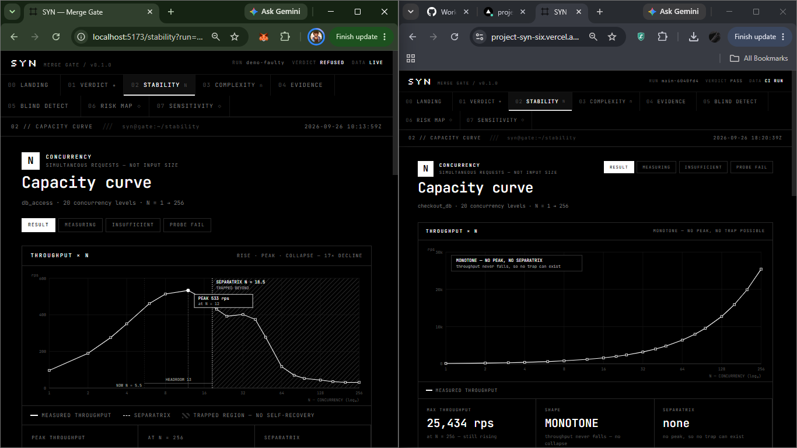
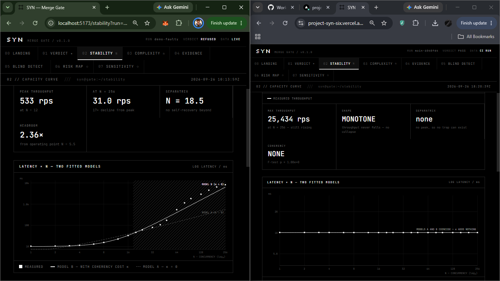
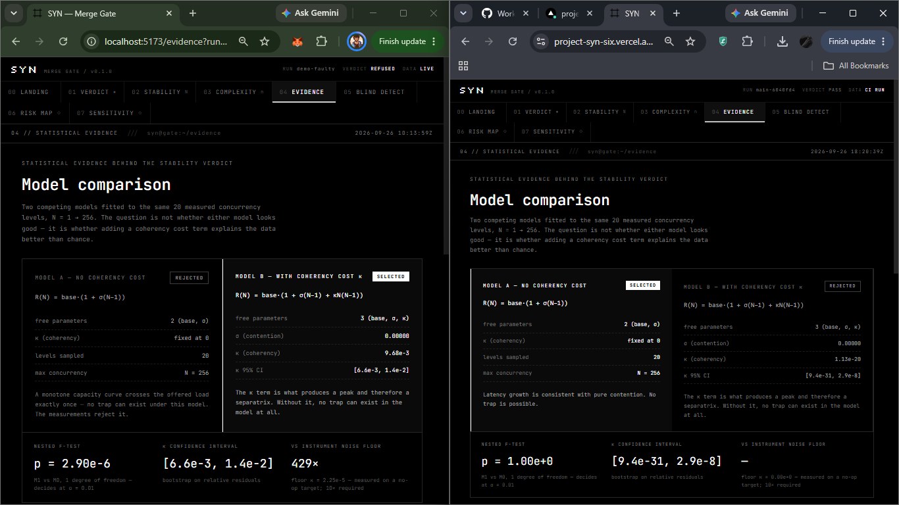
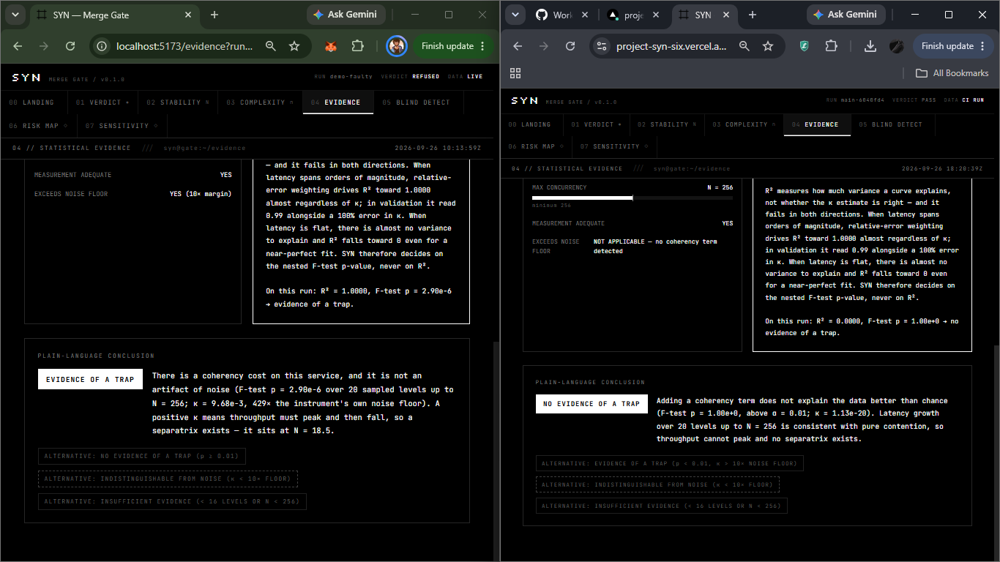
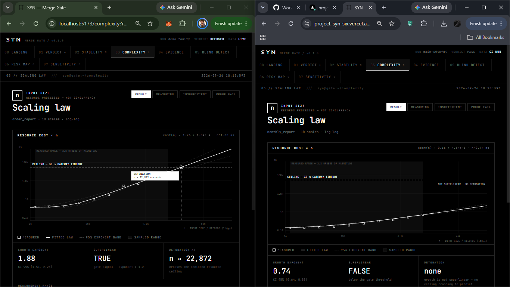
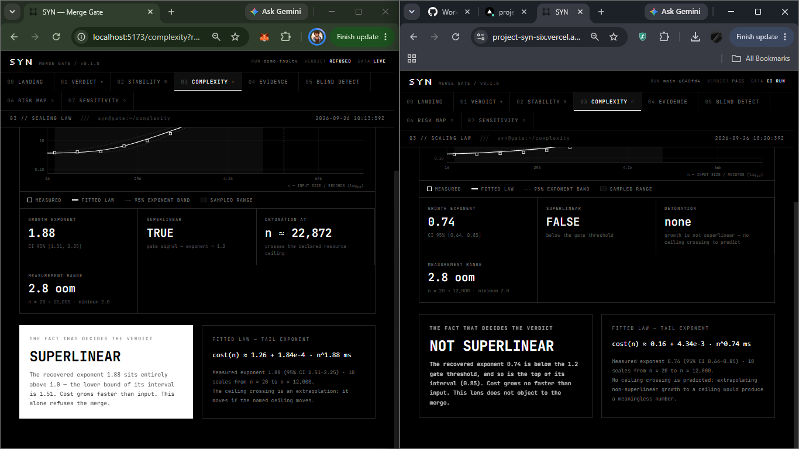
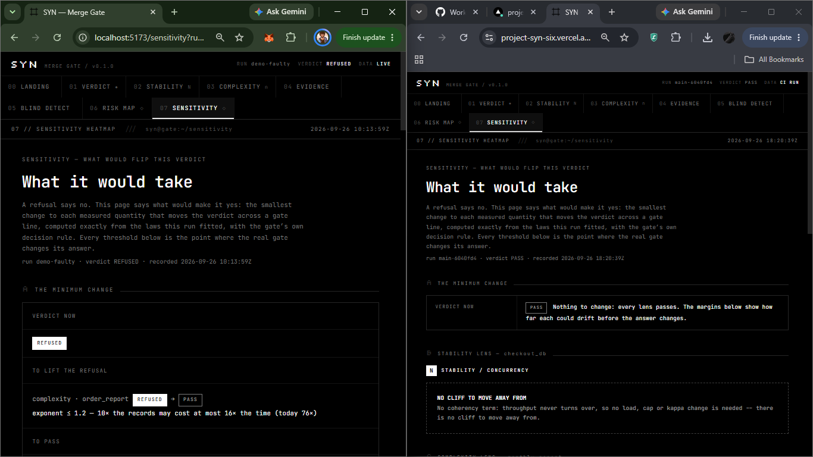
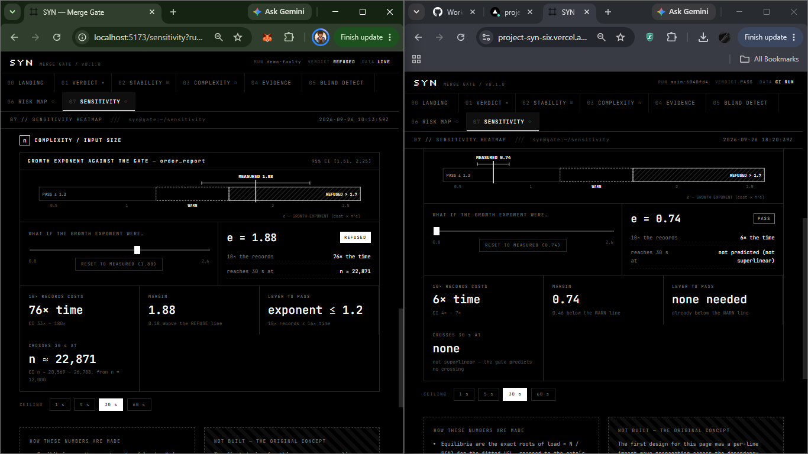

# SYN

**The guardian of the production manifold.** SYN measures the physical laws of a
codebase — its scaling law and its capacity curve — and refuses merges that
introduce structural collapse.

> It doesn't guess. It measures. **We find the cliff without going over it.**

---

## The proof

| | Result |
|---|---|
| **Blind detection** | **100%** across 3 random seeds — TP=3, FP=0, TN=6, FN=0 |
| **Complexity lens** | O(n²) recovered at exponent ≈ 2.0; O(n) faults cleared |
| **Stability lens** | κ > 0 detected at p ≈ 10⁻⁵ on a live contended service |
| **End-to-end gate** | Faulty → REFUSE, fixed → PASS, enforced by exit code |

Validated against negatives built specifically to fool it — an O(n log n) sort,
an N+1 query pattern (a *real* fault, but linear), and pure linear contention.
None were flagged.

---

## Try it: break the code, watch SYN refuse it

**Live dashboard:** https://project-syn-six.vercel.app — every run on it was
measured on a GitHub Actions runner, by the workflow in this repo, for a real
commit. Nothing on it is typed in by hand.

The gate protects [`sample_app/checkout.py`](sample_app/checkout.py)
(manifest: [`syn.ci.json`](syn.ci.json)). It ships healthy, so `main` passes.
Each fault is one line away:

| Lens | Change in `sample_app/checkout.py` | SYN's answer |
|---|---|---|
| Stability | `ContendedDB(coherency_k=0.0)` → `ContendedDB(coherency_k=1e-4)` | **REFUSED**: κ ≈ 1e-2, throughput collapses past N ≈ 10 |
| Complexity | `return build_order_report_fixed(n)` → `return build_order_report(n)` | **REFUSED**: growth exponent ≈ 2.0 |

1. Fork this repo, make one of the edits above (the GitHub web editor is fine)
   and open a pull request against this repo.
2. The **SYN gate** check measures your commit on the runner (about 2–4 minutes)
   and fails the check with a certificate in the job summary.
3. The **SYN publish** workflow comments the certificate on your PR and adds the
   run to the live dashboard as `pr-<number>-<sha>`. Open the dashboard's
   Verdict page and pick your run; Stability, Complexity, Evidence, Sensitivity
   and Risk Map all show that run's measurements. (The data refreshes within
   about 5 minutes.)

Notes, stated plainly:
- A first-time contributor's PR needs a maintainer to approve the workflow run
  (GitHub's default for forks). A PR from a branch in this repo runs immediately.
- The runner measures the code in CI, not in production — that is SYN's model:
  a merge gate from bounded, safe measurements.
- A PR can edit the gate itself. In real use, pin the gate to a trusted ref. The
  publish step never runs PR code: it validates the run artifact as data and
  only lets a PR publish its own run.

---

## Same pages, different code, different laws

The dashboard has no hardcoded results: every curve, number and verdict is
read from a stored run. Each screenshot below puts the same page side by side
for two different runs:

| | Left: `demo-faulty` | Right: `main-6040fd4` |
|---|---|---|
| Measured on | a developer laptop (`localhost`) | a GitHub Actions runner (the [live dashboard](https://project-syn-six.vercel.app)) |
| Manifest | `syn.json` | `syn.ci.json` |
| Stability target | `CONTENDED_DB`, coherency cost 1e-4 (planted fault) | `CHECKOUT_DB`, coherency cost 0.0 (healthy) |
| Complexity target | `build_order_report`, nested-loop join | `build_order_report_fixed`, indexed join |
| Verdict | **REFUSED** | **PASS** |

The layout is identical; the laws are not. (The machine differs too, so the
exact numbers are not comparable, but the shapes are: a fault that exists
produces a cliff on any machine, and a healthy service produces none.)

**Stability — throughput vs concurrency N.** Faulty: throughput peaks at
533 rps at N = 12, then collapses 17× by N = 256, with a separatrix at
N = 18.5. Healthy: each call costs a flat 10 ms, so throughput grows in
proportion to N, to 25,434 rps at N = 256. No peak, no cliff.



Latency tells the same story. Faulty: latency climbs steeply, and only the
model with a coherency term κ fits it. Healthy: latency is flat at 10 ms, and
the two models coincide.



**Evidence — does κ explain the data better than chance?** Faulty: the nested
F-test gives p = 2.90e-6, κ = 9.68e-3, 429× the instrument's own noise floor,
so there is evidence of a trap. Healthy: p = 1.00 and κ ≈ 1e-20, so there is
no evidence of a trap.




**Complexity — cost vs input size n.** Faulty: growth exponent 1.88
(95% CI 1.51–2.25), which crosses a 30 s timeout at n ≈ 22,872 records.
Healthy: exponent 0.74 (CI 0.64–0.85), no crossing predicted.




**Sensitivity — what would change the verdict.** Faulty: the smallest change
that lifts the refusal is bringing the exponent to 1.2 or below. Healthy:
nothing to change; the page shows only how far each quantity could drift
before the answer changes.




---

## Two lenses, two axes

Scaling in **input size** and scaling in **concurrency** are different physics
and need different instruments.

| Lens | Axis | Detects |
|---|---|---|
| **Complexity** | input size *n* | Algorithmic detonation — O(nˣ) |
| **Stability** | concurrency *N* | Metastable collapse — coherency cost κ |

Neither lens requires inducing a failure. SYN measures bounded, safe operating
points and derives where the cliff is.

---

## Quickstart

```bash
pip install -e ".[dev]"            # add ",twin" for the PyTorch Twin checks

python tests/check_14_blind.py     # blind detection — the integrity proof
python -m gateway.ci_gate          # run the merge gate (exit 1 = refused)
```

Declare what to probe in `syn.json`:

```json
{
  "syn": {
    "complexity": [
      {"name": "order_report",
       "target": "sample_app.order_service:build_order_report",
       "n_min": 20, "n_max": 12000, "points": 10}
    ],
    "stability": [
      {"name": "db_access",
       "target": "sample_app.contended_db:CONTENDED_DB.call"}
    ]
  }
}
```

**Exit codes:** `0` allowed · `1` refused · `2` gate could not run.
Exit 2 is distinct on purpose — a gate that fails to run must never be read as
approval.

---

## CI

Two workflows (`.github/workflows/`):

- **`syn.yml` — SYN gate** (read-only). On every PR and push to `main`:
  calibrates this runner's noise floor, measures `syn.ci.json`, and fails the
  check when the verdict is REFUSED. Exit `0` allowed · `1` refused · `2` could
  not run. Installs only `requirements-ci.txt` (no PyTorch).
- **`syn-publish.yml` — SYN publish** (`workflow_run`, write access, never runs
  PR code). Validates the run artifact, commits it to the `syn-runs` branch,
  exports every API response as static JSON (`gateway/export_static.py`), and
  comments the certificate on the PR.

Run it manually with **Actions → SYN gate → Run workflow**, ticking
*seed_demos* to re-measure the four demo runs (faulty / clean / warn / unknown)
and blind detection on the runner.

The dashboard reads the published JSON directly — no server:

```bash
cd frontend
VITE_DATA_BASE_URL=https://raw.githubusercontent.com/<owner>/<repo>/syn-runs/api npm run build
```

Against a live API instead: `uvicorn gateway.api:app` and
`VITE_API_BASE_URL=http://localhost:8000/api`.

Locally, the same gate:

```bash
python -m gateway.ci_run --manifest syn.ci.json --run-id local-1 --out-dir syn-out --calibrate
```

---

## How it works

**Complexity** — sweep a callable across log-spaced input sizes with median-of-k
timing, recover the scaling law with two independent selectors, and gate on
*superlinearity* rather than a class label. Below two decades of range, report
insufficient evidence rather than guessing.

**Stability** — measure latency at bounded concurrency levels and test for
evidence of coherency cost by nested F-test:

```
M0:  R = base·(1 + σ(n−1))                  no coherency
M1:  R = base·(1 + σ(n−1) + κ·n(n−1))       coherency
```

κ > 0 means throughput is retrograde, which means a separatrix exists — and its
location follows analytically. No collapse is ever induced.

---

## Documentation

- **[BLUEPRINT.md](BLUEPRINT.md)** — the full engineering record: the failure
  narrative, the three category errors that killed earlier designs, the build
  sequence, and the Claims Discipline table.

## Scope

SYN validates **classification**: given candidate targets, which are risky.
Selecting candidates automatically in a large repository is graph analysis,
deferred to Phase 2. Verdicts are statistical early warnings with stated
p-values — not proofs.
